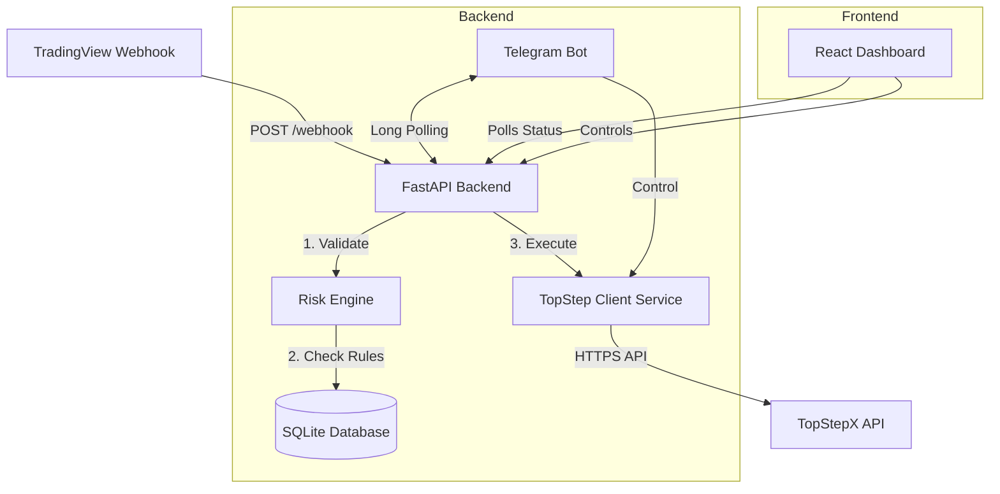

# System Architecture - TopStepX Trading Bot

## 1. High-Level Architecture

The system follows a typical **Client-Server** architecture, designed for local deployment.

## 2. Components

### 2.1 Backend (Python / FastAPI)
- **Role**: Central coordinator. Handles webhooks, manages state, enforces risk, and communicates with external APIs.
- **Framework**: FastAPI (for high performance and easy JSON validation with Pydantic).
- **Services**:
    - `RiskEngine`: Contains the logic for "Guardian" checks (Time filters, Max Loss, etc.).
    - `TopStepClient`: Wrapper around `httpx` to handle authentication (Login/Logout), order placement, and position management (Close/Flatten) with TopStepX.
    - `TelegramBot`: **NEW** - Independent service using `asyncio` loop for 2-way communication. Handles commands (`/status`, `/flatten`, `/switch`) and sends notifications.
- **Database**: 
    - **SQLite** (`trading_bot.db`): Stores persistency data (Trades, Logs, Settings, Account ID).
    - **ORM**: SQLAlchemy.

### 2.2 Frontend (React / Vite)
- **Role**: User Interface for monitoring and control.
- **Tech Stack**: React 18, TypeScript, TailwindCSS, Lucide Icons.
- **Components**: 
    - `ConfirmationModal` (reusable UI for dangerous actions).
    - `ConfigModal` (Settings management for Risk/Time).
    - `MockWebhookModal` (Simulation tool for triggering fake alerts).
    - `AccountSelector` (Custom Dropdown), `ControlPanel`.
- **Communication**: 
    - Fetches data via **Polling** (every 2-5 seconds) from Backend API (`/api/dashboard/*`).
    - Sends commands (Connect, Select Account, Switch Toggle, Config Update) via REST POST requests.

- **Integration Points**:
    - **Incoming**: `POST /api/webhook`, `POST /dashboard/config`, `POST /dashboard/positions/close`, `POST /dashboard/account/flatten`.
    - **Outgoing**: `https://api.topstepx.com`
        - Endpoints: `/api/Auth/loginKey`, `/api/Auth/logout`, `/api/Order/place`, `/api/Order/modify`, `/api/Contract/available`.

## 3. Data Flow: Trade Execution

1.  **Trigger**: `routers/webhook.py` receives a POST request (Real or Mock).
    - **Payload**: Now accepts optional `strat` parameter (e.g., "RobReversal").
2.  **Validation (Type Check)**:
    - If `type == "SETUP"`: Logs the Setup event and exits (No Trade).
    - If `type == "SIGNAL"`: Proceeds to trade execution logic.
3.  **Risk Check**: 
    - `RiskEngine` loads current settings (Blocked times, Master Switch, Blocked Enabled Toggle).
    - **Check 1**: Is Master Switch ON?
    - **Check 2**: Is Time within allowed hours? (Skipped if global toggle is Disabled).
    - **Check 3**: Is there already an Open Position for this Ticker? (Prevents stacking).
    - If NO -> Status `REJECTED`, Reason Logged.
4.  **Sizing**: 
    - Fetches Contract Details (Tick Size, Tick Value) - cached for performance.
    - Calculates Quantity based on Risk Settings (e.g. $200 risk / distance to SL).
5.  **Execution (Robust Strategy)**:
    - `TopStepClient` places a **Market Order** with tick-based brackets (approximate).
    - **Correction**: Immediately after placement, the system calls `update_sl_tp_orders`.
    - **Modification**: It fetches the working SL/TP orders and uses `/api/Order/modify` to set their `stopPrice` and `limitPrice` to the exact absolute values defined in the signal.
6.  **Confirmation**:
    - Response from TopStepX (Order ID) is saved to the DB.
    - Status updated to `OPEN` or `REJECTED`.

## 4. Security & Configuration
- **Environment Variables**: API Keys and credentials are stored in `.env` (never committed to git).
- **CORS**: Configured to allow localhost frontend ports (5173, 5174).
